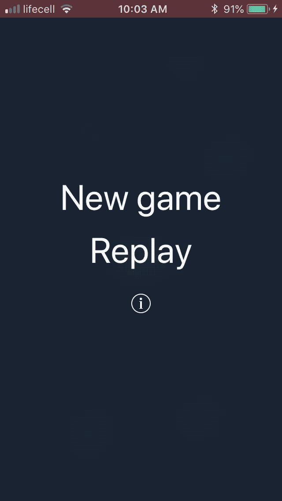

# Snake
Snake game for iOS 

A project I was working on in the first round of DevChallenge 12 (local hackathon held this summer). 
The task was to implement “Snake” game for iOS. To control the snake, we weren’t allowed to use a touchscreen but we could use any other device's sensors as we liked. It was also required to have dynamically generated obstacles, state preservation, tutorial, pause and replay functionality.

Just for fun, I decided to go with FRP and made all the logic reactive. I decided to use the device’s rotation to control the snake. 

